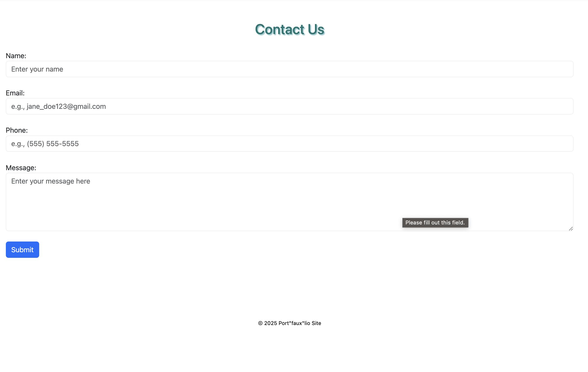

# Port "faux" lio - Project Portfolio Mockup

## Table of Contents

- [Port "faux" lio - Project Portfolio Mockup](#port-faux-lio---project-portfolio-mockup)
  - [Table of Contents](#table-of-contents)
  - [Introduction](#introduction)
  - [Features](#features)
    - [HTML](#html)
    - [CSS](#css)
    - [Bootstrap](#bootstrap)
    - [JavaScript](#javascript)
  - [Prerequisites](#prerequisites)
  - [Usage](#usage)
  - [Installation](#installation)
  - [Collaborators](#collaborators)
  - [Authors](#authors)
  - [Screenshots](#screenshots)
    - [Home Page](#home-page)
    - [Projects Page](#projects-page)
    - [Training Page](#training-page)
    - [Contact Page](#contact-page)
  - [Future Enhancements](#future-enhancements)
    - [JavaScript Functions](#javascript-functions)

## Introduction

Port "faux" lio is a mockup project portfolio website designed to showcase how I might layout my future project portfolio of software development and web design projects. This website serves as a template for organizing and presenting various projects, utilizing HTML, CSS, Bootstrap, and JavaScript to create a responsive and visually appealing design.

## Features

### HTML

- **Semantic HTML**: Utilized semantic HTML elements for better structure and accessibility.
- **Responsive Design**: Ensured responsiveness using Bootstrap's grid system and utility classes.
- **Navigation Bar**: Implemented a fixed-top navigation bar for easy access to different sections of the website.

### CSS

- **Custom Styles**: Created custom CSS files for each page to enhance the visual appearance.
- **Flexbox**: Used Flexbox for layout and alignment of elements within cards and other components.
- **Text Styling**: Applied custom text styles, including font sizes, colors, and shadows.

### Bootstrap

- **Grid System**: Used Bootstrap's grid system to create a responsive layout for project cards and other sections.
- **Components**: Incorporated various Bootstrap components such as cards, buttons, and accordions.
- **Utilities**: Utilized Bootstrap's spacing and alignment utilities for consistent styling.

### JavaScript

- **Custom Functions**: Added JavaScript functions for future enhancements, such as formatting usernames, greeting clients, listing project ideas, and managing feedback.
- **Bootstrap Integration**: Integrated Bootstrap's JavaScript libraries for interactive components like the carousel and accordion.

## Prerequisites

- A modern web browser (e.g., Chrome, Firefox, Safari)
- Basic knowledge of HTML, CSS, and JavaScript
- Familiarity with Bootstrap framework

## Usage

1. **Navigation**: Use the fixed-top navigation bar to access different sections of the website.
2. **Project Cards**: Explore the project cards on the Projects page to view details about each project.
3. **Training Resources**: Check out the Training page for free coding resources and tutorials.
4. **Contact Form**: Use the Contact page to get in touch with me.

## Installation

1. **Clone the Repository**:
   ```sh
   git clone https://github.com/jenplanque/port-faux-lio-site.git
   ```
2. **Navigate to the Project Directory**:
   ```sh
   cd port-faux-lio-site
   ```
3. **Open the Project in a Web Browser**:
   - Open `index.html` in your preferred web browser.

## Collaborators

- **Jen Planque**: Project creator and primary developer.

## Authors

- **Jen Planque**: [GitHub Profile](https://github.com/jenplanque)

## Screenshots

### Home Page


### Projects Page


### Training Page


### Contact Page



## Future Enhancements

### JavaScript Functions

- **Format Username**: Convert usernames to lowercase and remove spaces.
  ```javascript
  function formatUsername(username) {
    return username.replace(/\s+/g, '').toLowerCase();
  }
  ```
- **Greet Client**: Display a custom greeting message.
  ```javascript
  function greetClient() {
    const client = 'John Doe';
    const greeting = `Hello, ${client}!`;
    return greeting;
  }
  ```
- **List Project Ideas**: Return a list of project ideas from an array.
  ```javascript
  const projectIdeas = ['iOS game', 'Blog', 'Mobile App'];
  function listProjectIdeas() {
    return projectIdeas;
  }
  ```
- **Add Feedback**: Display verbiage from feedback form.
  ```javascript
  let feedback = [];
  function addFeedback(message) {
    feedback.push(message);
    return feedback;
  }
  ```

These functions will be incorporated into the website in future updates to enhance user interaction and functionality.

---

This README provides an overview of the Port "faux" lio mockup, highlighting key features, usage instructions, and future enhancements. The project serves as a template for organizing and presenting software development and web design projects in a professional and visually appealing manner.
